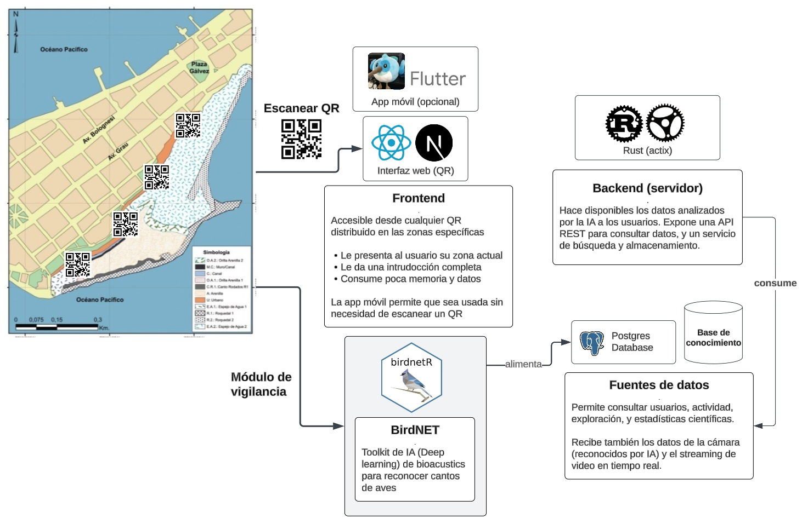

# Arenilla Go

Mobile-first interactive web app for bird discovery at the **Humedal Costero Poza de la Arenilla (HCPA)**, La Punta, Callao, Peru. Inspired by Pokemon GO — visitors walk through 4 physical stations along the wetland, use their phone camera to discover bird species, and build a digital collection of 63 wetland birds.

## Architecture



### Tech Stack

| Layer | Technology | Purpose |
|---|---|---|
| Framework | React 19 + TypeScript | UI & type safety |
| Build | Vite 8 | Dev server & bundling |
| State | Zustand 5 | Client-side stores |
| Auth | Clerk | Sign-in/sign-up (optional in dev) |
| Maps | Leaflet + react-leaflet | Interactive station map |
| 3D | React Three Fiber + drei | Interactive bird model viewers |
| i18n | i18next + react-i18next | Spanish (default) / English |
| Routing | react-router-dom | URL param handling |
| Data | Static JSON + localStorage | No backend — all data is local |

### Data Flow

```
main.tsx
  └─ ClerkProvider
       └─ App
            └─ AppShell
                 ├─ TabBar (bottom nav)
                 └─ Active page component
                      │
                      ├─ ExplorarPage
                      │    ├─ ZoneHeader (station selector + tide)
                      │    ├─ MapView (Leaflet map with telescope markers)
                      │    ├─ CameraFeed (prerecorded video per station)
                      │    ├─ SpottedList → SpeciesCard (mock detections)
                      │    └─ SpeciesDetail (full info, 3D, audio, discover)
                      │
                      ├─ MisionesPage
                      │    ├─ ModoExplorador → BirdCamera → EncounterAnimation
                      │    └─ BuscaTuAve → trait filter → results → SpeciesDetail
                      │
                      ├─ ColeccionPage
                      │    ├─ ProgressTracker (X/63 discovered)
                      │    ├─ SpeciesGrid (search + filter + discovered/undiscovered)
                      │    └─ BadgesSection (4 achievement badges)
                      │
                      └─ PerfilPage
                           ├─ AuthControls (Clerk sign-in/up)
                           ├─ LanguageToggle (ES/EN)
                           ├─ StatsSection (counts)
                           └─ About HCPA section
```

## Project Structure

```
src/
├── main.tsx                    # Entry point — ClerkProvider + StrictMode
├── App.tsx                     # Root component — renders AppShell
├── index.css                   # All styles, CSS custom properties, animations
├── types/
│   ├── bird.ts                 # Bird, IucnStatus, Seasonality, CitesAppendix
│   ├── station.ts              # StationId, Station, STATIONS[], MAP_CENTER
│   ├── discovery.ts            # Discovery (birdId, stationId, discoveredAt, photoUrl?)
│   └── badge.ts                # Badge, BADGES[] (4 achievement definitions)
├── data/
│   ├── birds.ts                # loadBirds(), getBirdImage(), getBirdModelPath(),
│   │                           # getBirdAudioPath(), deriveSizeCategory(), deriveBirdType()
│   ├── detections.ts           # generateMockDetections(), getSpottedBirds()
│   └── stations.ts             # getStationById(), getStationFromUrl()
├── store/
│   ├── useAppStore.ts          # activeTab, currentStation, initStation
│   └── useDiscoveries.ts       # discoveries[], addDiscovery(), isDiscovered()
├── i18n/
│   ├── index.ts                # i18next init — forced lng: "es"
│   ├── es.ts                   # Spanish translations
│   └── en.ts                   # English translations
├── components/
│   ├── AppShell.tsx            # Root shell — tab routing + page rendering
│   ├── TabBar.tsx              # Bottom navigation (4 SVG icon tabs)
│   ├── MapView.tsx             # Leaflet map with telescope station markers
│   ├── SpeciesCard.tsx         # Bird thumbnail card (discovered/undiscovered states)
│   ├── SpeciesDetail.tsx       # Full species detail view (3D, audio, discover actions)
│   ├── ConservationBadge.tsx   # IUCN status colored pill
│   ├── SeasonalityBadge.tsx    # Migration status pill
│   ├── Model3DViewer.tsx       # React Three Fiber .glb viewer
│   └── AudioPlayer.tsx         # Play/pause audio button
└── features/
    ├── explorar/
    │   ├── ExplorarPage.tsx     # Zone header + map + camera feed + spotted list
    │   ├── ZoneHeader.tsx       # Station selector buttons, tide indicator
    │   ├── CameraFeed.tsx       # Prerecorded video with "live" label
    │   └── SpottedList.tsx      # Grid of mock-detected species at station
    ├── misiones/
    │   ├── MisionesPage.tsx     # Tab container (Explorador / Busca tu Ave)
    │   ├── ModoExplorador.tsx   # Camera-based discovery flow
    │   ├── BirdCamera.tsx       # Full-screen getUserMedia camera capture
    │   ├── EncounterAnimation.tsx # Discovery celebration overlay
    │   └── BuscaTuAve.tsx       # Trait-based bird search (size/plumage/type/season)
    ├── coleccion/
    │   ├── ColeccionPage.tsx    # Progress + grid + badges
    │   ├── SpeciesGrid.tsx      # Searchable/filterable species grid
    │   ├── ProgressTracker.tsx  # Discovery progress bar
    │   └── BadgesSection.tsx    # Achievement badges display
    └── perfil/
        ├── PerfilPage.tsx       # Auth + language + stats + about
        ├── AuthControls.tsx     # Clerk sign-in/up UI
        ├── LanguageToggle.tsx   # ES/EN toggle
        └── StatsSection.tsx     # Discovery & badge counts

public/
├── favicon.png                 # Bird icon
├── telescope.png               # Telescope icon (map markers)
└── db/
    ├── birds.json              # 63 species records
    ├── images/                 # ~315 JPG bird photos
    ├── models/                 # .glb 3D models
    │   ├── larus_belcheri.glb
    │   └── chroicocephalus_cirrocephalus.glb
    ├── audio/                  # .mp3 vocalizations
    │   ├── larus_belcheri.mp3
    │   └── chroicocephalus_cirrocephalus.mp3
    └── videos/                 # Prerecorded station camera feeds
        ├── station_a.mp4
        ├── station_b.mp4
        ├── station_c.mp4
        └── station_d.mp4
```

## Type Definitions

### Bird (`src/types/bird.ts`)

```typescript
type IucnStatus = "LC" | "NT" | "VU" | "EN" | "CR" | "DD" | "NE";
type Seasonality = "RE" | "MB" | "MA" | "MS" | "ML" | "ACC";
type CitesAppendix = "I" | "II" | "III";

interface Bird {
  scientific_name: string;
  common_name: string;
  iucn_status: IucnStatus;
  seasonality: Seasonality;
  cites_appendix?: CitesAppendix;
  size: string;
  weight: string;
  juvenile_noted?: string;
  distribution?: string;
  vocalization?: string;
  male_plumage?: string;
  female_plumage?: string;
  zone_in_humedal?: string;
  description: string;
  page?: number;
  images: string[];
}
```

### Station (`src/types/station.ts`)

```typescript
type StationId = "A" | "B" | "C" | "D";

interface Station {
  id: StationId;
  label: string;
  lat: number;
  lng: number;
  videoSrc: string;
  speciesIds: string[];
}
```

4 stations with GPS coordinates within HCPA:

| Station | Label | Coordinates | Video |
|---|---|---|---|
| A | Estación A – Urbana | -12.074006, -77.162610 | `station_a.mp4` |
| B | Estación B – Lagunas | -12.072702, -77.160723 | `station_b.mp4` |
| C | Estación C – Mar | -12.070789, -77.159469 | `station_c.mp4` |
| D | Estación D – Playa | -12.069619, -77.158699 | `station_d.mp4` |

Map center: **-12.071228, -77.160295**

### Discovery (`src/types/discovery.ts`)

```typescript
interface Discovery {
  birdId: string;       // scientific_name
  stationId: StationId;
  discoveredAt: string;  // ISO 8601
  photoUrl?: string;
}
```

### Badge (`src/types/badge.ts`)

4 achievement badges:

| Badge | Condition |
|---|---|
| Explorador Costero | Discover 5 species |
| Observador Migratorias | Discover 5 species (intended: migratory) |
| Guardián Biodiversidad | Discover 10 species |
| Maestro Humedal | Discover 20 species |

## State Management

### `useAppStore` (Zustand)

| Field | Type | Default | Description |
|---|---|---|---|
| `activeTab` | `TabId` | `"explorar"` | Current bottom tab |
| `currentStation` | `StationId \| null` | `null` | Selected station |
| `initStation()` | — | — | Reads `?zone=` from URL on mount |

### `useDiscoveries` (Zustand + localStorage)

| Field | Type | Description |
|---|---|---|
| `discoveries` | `Discovery[]` | Persisted under `arenilla-go-discoveries` |
| `addDiscovery(birdId, stationId, photoUrl?)` | — | Adds new discovery (no duplicates) |
| `isDiscovered(birdId)` | `boolean` | Checks if species already discovered |
| `getDiscoveredBirdIds()` | `string[]` | Returns all discovered bird IDs |
| `clearDiscoveries()` | — | Wipes localStorage + resets state |

**Seed species** (5 pre-discovered on first launch):

1. *Larus belcheri*
2. *Chroicocephalus cirrocephalus*
3. *Pelecanus thagus*
4. *Ardea alba*
5. *Sula variegata*

## Mock AI Detection (`src/data/detections.ts`)

Species detection is simulated and varies by time of day:

| Time | Detection probability | Min detections |
|---|---|---|
| Morning (5–12h) | 70% | 3 |
| Day (12–18h) | 40% | 3 |
| Night (18–5h) | 15% | 3 |

Each detection has a `confidence` value (0.6–0.99) and a `lastSeen` timestamp.

## Bird Classification Helpers (`src/data/birds.ts`)

### `deriveBirdType(bird)` → `BirdType`

Keyword-matches on `common_name` to categorize into 16 types:

`pato`, `garza`, `gaviota`, `chorlo`, `playero`, `cormoran`, `pelicano`, `gallinazo`, `falaropo`, `ostrero`, `ibis`, `paloma`, `gavilan`, `piquero`, `parihuana`, `alcarravan`

Default fallback: `"playero"`

### `deriveSizeCategory(bird)` → `"pequeno" | "mediano" | "grande"`

Extracts first number from `bird.size` string:

- < 30 cm → `"pequeno"`
- 30–70 cm → `"mediano"`
- \> 70 cm → `"grande"`

### 3D Model Species

11 species are configured for 3D model viewing (`.glb` files in `public/db/models/`):

1. *Spatula cyanoptera*
2. *Phoenicopterus chilensis*
3. *Sula variegata*
4. *Phalacrocorax brasilianus*
5. *Pelecanus thagus*
6. *Ardea alba*
7. *Egretta thula*
8. *Larus belcheri* ✓ (model available)
9. *Chroicocephalus cirrocephalus* ✓ (model available)
10. *Numenius phaeopus*
11. *Calidris pusilla*

Only 2 models currently have `.glb` files (marked ✓).

### Audio Species

2 species have audio vocalizations in `public/db/audio/`:

1. *Larus belcheri*
2. *Chroicocephalus cirrocephalus*

## Design Tokens (`src/index.css`)

### Color Palette — La Punta Ocean/Coast Theme

| Variable | Value | Usage |
|---|---|---|
| `--ocean-deep` | `#0c2d48` | Headings, primary text |
| `--ocean-mid` | `#145374` | Section labels, tab bar background |
| `--ocean-light` | `#2e8bc0` | Active states, links, badges |
| `--ocean-bar` | `#145374` | Bottom tab bar background |
| `--seafoam` | `#4dbfa0` | Discover button, progress bar, search |
| `--sand` | `#d4b483` | Sandy beige accent |
| `--sand-light` | `#f5efe6` | Page background |
| `--sunset` | `#e07a3a` | CITES badge, camera button |
| `--sunset-light` | `#f4a261` | Light orange accent |

### IUCN Status Colors

| Variable | Value | Status |
|---|---|---|
| `--iucn-lc` | `#22c55e` | Least Concern |
| `--iucn-nt` | `#eab308` | Near Threatened |
| `--iucn-vu` | `#f97316` | Vulnerable |
| `--iucn-en` | `#ef4444` | Endangered |
| `--iucn-cr` | `#a855f7` | Critically Endangered |

### Key Layout Rules

- Mobile-first: `.app-shell` max-width 480px, centered
- Tab bar: fixed bottom, `z-index: 50`, solid `var(--ocean-bar)` background
- Sticky headers: `z-index: 30`, below modals (100) and tab bar (50)
- No gradients anywhere — flat colors only
- Light theme only

## Internationalization

- **Default language**: Spanish (forced `lng: "es"`, no browser detection)
- `i18next-browser-languagedetector` is installed but not used in config
- Language toggle available in Perfil tab
- Translation keys organized by feature: `tabs.*`, `explorar.*`, `misiones.*`, `coleccion.*`, `perfil.*`, `species.*`, `seasonality.*`, `iucn.*`

## Authentication (Clerk)

- Publishable key stored in `.env` as `VITE_CLERK_PUBLISHABLE_KEY`
- Optional in dev: keys starting with `pk_test_` are accepted
- App throws at startup if key is missing
- `ClerkProvider` wraps the entire app in `main.tsx`
- Sign-in/sign-up via modal buttons in Perfil tab
- Signed-in users get `UserButton` widget

## Key User Flows

### Station Selection

1. User opens app → sees map with 4 pulsing yellow-glow telescope markers
2. Taps a marker → `currentStation` set in store, URL updated with `?zone=A`
3. Camera feed activates for that station (prerecorded video)
4. SpottedList shows mock-detected species at the station

### Species Discovery

1. User taps an undiscovered species card → opens SpeciesDetail
2. Two action buttons: **Tomar foto** (camera) and **Grabar avistamiento** (video record)
3. Placeholder buttons — no capture functionality implemented yet

### Explorer Mode (Misiones tab)

1. Shows grid of nearby species at current station
2. "Open camera" → full-screen device camera via `getUserMedia`
3. User captures photo → mock AI identification (2s spinner)
4. Random nearby species selected → auto-discovered → EncounterAnimation → SpeciesDetail

### Find Your Bird (Misiones tab)

1. User selects traits: size, plumage color, bird type, seasonality
2. `matchBird()` scores each species against selected traits
3. Results displayed as SpeciesCard grid
4. Optionally scoped to current station's species

## Scripts

```bash
bun run dev       # Start Vite dev server
bun run build     # TypeScript check + Vite production build
bun run lint      # ESLint
bun run preview   # Preview production build locally
```

## Environment Variables

| Variable | Required | Description |
|---|---|---|
| `VITE_CLERK_PUBLISHABLE_KEY` | Yes | Clerk publishable key (throws if missing) |

## QR Code Strategy

QR codes are plain URLs with a zone parameter (not deep links):

```
https://your-domain.com/?zone=A
https://your-domain.com/?zone=B
https://your-domain.com/?zone=C
https://your-domain.com/?zone=D
```

QRs are placed only in the Urbana zone (Station A). Other stations are reached by walking the path.

## Future Work

- Replace station videos with different clips per station
- Add 3D bird models for remaining 9 species
- Add more audio vocalizations
- Implement photo capture and video record for discovery flow
- PWA support (service worker, offline, install prompt)
- Visual polish pass
- Social features (share discoveries)
